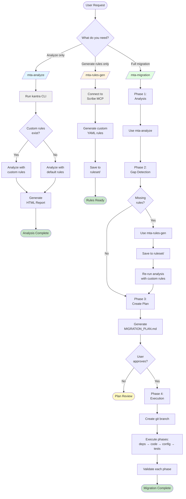

# MTA Skills for AI Agents

Three complementary skills for Java application migration powered by Konveyor/MTA:

1. **mta-analyze** - Analyze codebases for migration readiness using kantra CLI
2. **mta-rules-gen** - Generate custom migration rules using the Scribe MCP server
3. **mta-migration** - Orchestrate end-to-end application migrations with planning and execution

## Workflow



## Installation

**Local install** (installs to `.claude/skills/` in current directory):
```bash
npx @sshaaf/mta-skill
```

**Global install** (installs to `~/.claude/skills/` for all projects):
```bash
npx @sshaaf/mta-skill -g
```

The skill will be available to any AI agent that supports the `.claude/skills/` directory structure.

## Usage

### MTA Analysis (`/mta-analyze`)

Analyze your codebase for migration readiness:

```
/mta-analyze analyze this codebase for migration to EAP 8
```

Or naturally:
```
Analyze this Java app for migration to Quarkus
Check if we can migrate to EAP 8
Run a cloud readiness assessment
```

The skill will:
1. Check if kantra is installed
2. Auto-detect custom migration rules
3. Run the analysis with appropriate targets
4. Generate a detailed HTML report
5. Summarize key findings and migration effort

### Rules Generation (`/mta-rules-gen`)

Generate custom migration rules using Scribe:

```
/mta-rules-gen create rules for Spring Boot 2 to 3 migration
```

Or naturally:
```
Generate rules to detect deprecated Spring Security configs
Create rules for WebLogic JMS to Jakarta JMS migration
I need rules to flag our internal deprecated APIs
```

The skill will:
1. Connect to Scribe MCP server (http://localhost:8080/mcp/sse)
2. Generate custom MTA rules based on your requirements
3. Save rules as YAML files in migration-rules/
4. Provide usage instructions for kantra --rules flag

### Migration Orchestration (`/mta-migration`)

Orchestrate complete application migrations:

```
/mta-migration migrate this Spring Boot 2.7 app to 3.2
```

Or naturally:
```
Migrate this application from WebLogic to Quarkus
Upgrade this app from Java EE 7 to Jakarta EE 10
Modernize this application to Spring Boot 3
```

The skill will:
1. Run MTA analysis on your codebase
2. Identify gaps and generate custom rules if needed
3. Create a comprehensive migration plan with phases
4. Create a git branch for safe execution
5. Execute the migration with validation at each step
6. Provide rollback instructions if needed

## Example Workflows

### Workflow 1: Analysis-Only

```
# Step 1: Generate custom rules
You: Create migration rules for detecting Spring Boot 2.x security configs

Agent: [uses mta-rules-gen]
       Generated rules saved to: migration-rules/springboot2-security-rules.yaml
       
       Rules detect:
       • Deprecated WebSecurityConfigurerAdapter
       • Old authentication patterns
       • Changed property names
       
       Usage: kantra analyze --rules=./migration-rules ...

# Step 2: Analyze codebase with custom rules
You: Now analyze this codebase for Spring Boot 3 migration using those rules

Agent: [uses mta-analyze]
       Running kantra with custom rules...
       
       Migration Analysis Complete
       
       Key Findings:
       • Total Issues: 18 mandatory, 12 optional, 5 potential
       • Custom rules found: 8 security configuration issues
       • Estimated Effort: 52 story points
       
       📊 Full Report: /path/to/kantra-output-*/static-report/index.html
```

### Workflow 2: Full Migration Orchestration

```
You: Migrate this Spring Boot 2.7 application to Spring Boot 3.2

Agent: [uses mta-migration]
       
       Phase 1: Analysis
       Running MTA analysis...
       Found 15 mandatory issues, 8 optional improvements
       
       Phase 2: Gap Analysis
       Identified missing rules for internal APIs
       Generating custom rules via Scribe MCP...
       Saved to: ruleset/custom-rules.yaml
       
       Phase 3: Migration Plan
       Created comprehensive plan: MIGRATION_PLAN.md
       
       Estimated effort: 42 story points
       • Dependency updates: 8 points
       • Code migrations: 28 points
       • Configuration: 6 points
       
       Would you like me to execute this migration?

You: Yes, proceed

Agent: Creating migration branch: migration/springboot27-to-32-20260519
       
       Executing Phase 1: Dependency Updates
       ✓ Updated parent POM to Spring Boot 3.2.x
       ✓ Build successful
       
       Executing Phase 2: Code Migrations
       ✓ Migrated javax.validation → jakarta.validation
       ✓ Updated SecurityConfig (removed WebSecurityConfigurerAdapter)
       ✓ Code compiles successfully
       
       Executing Phase 3: Tests
       ✓ All tests passing
       
       Migration Complete!
       Review changes: git diff main..migration/springboot27-to-32-20260519
```

## Supported Migration Targets

- **JBoss EAP**: `eap6`, `eap7`, `eap8`
- **Cloud Native**: `quarkus`, `cloud-readiness`, `camel`
- **OpenJDK**: `openjdk11`, `openjdk17`, `openjdk21`
- **Frameworks**: `spring-boot`, `jakarta-ee`

## Requirements

### Both Skills
- **AI agent** that supports skills (Claude Code, Cline, Roo-Code, etc.)
- **Java codebase** to work with

### MTA Analysis (`mta-analyze`)
- **Kantra CLI** - Install from https://github.com/konveyor/kantra/releases

### Rules Generation (`mta-rules-gen`)
- **Scribe MCP Server** - Install from https://github.com/sshaaf/scribe
- Server must be running at http://localhost:8080/mcp/sse

### Migration Orchestration (`mta-migration`)
- **Kantra CLI** - Install from https://github.com/konveyor/kantra/releases
- **Scribe MCP Server** (for custom rule generation) - https://github.com/sshaaf/scribe
- **Git repository** - Codebase must be in a git repo for safe branching

## What It Does

### MTA Analysis Skill
Automates the complete kantra analysis workflow:
- Detects migration targets from natural language requests
- Auto-discovers and offers to use custom rule sets
- Creates timestamped output directories for tracking progress
- Parses and summarizes analysis results with key metrics
- Generates detailed HTML reports for in-depth review
- Suggests next steps based on findings

### Rules Generation Skill
Enables custom migration rule creation:
- Uses Scribe MCP server for intelligent rule generation
- Creates properly formatted MTA/Konveyor YAML rulesets
- Generates rules for specific migration scenarios
- Includes effort estimates and severity levels
- Provides transformation hints and documentation links
- Saves rules in reusable format for kantra --rules flag

### Migration Orchestration Skill
Automates the complete migration lifecycle:
- Combines MTA analysis with custom rule generation
- Creates comprehensive migration plans with phases
- Manages git branches for safe execution
- Validates each phase (build, tests, startup)
- Handles dependency updates, code changes, and configuration
- Provides rollback instructions if migration fails
- Commits changes incrementally for easy review

## Compatible AI Agents

This skill works with any agent system that supports the skill format:
- **Claude Code** (CLI, desktop, web)
- **Cline** (VS Code extension)
- **Roo-Code** (VS Code extension)
- **Continue** (IDE extension)
- Other skill-compatible AI agents
